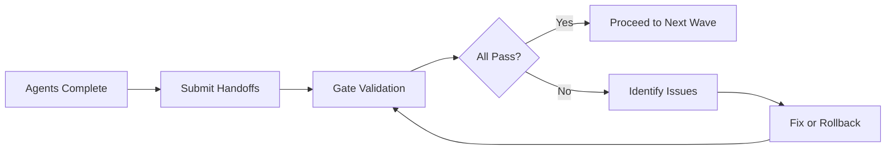

# Coordination Protocol

## Communication Framework

This document defines how agents communicate status, hand off work, and coordinate integration during the knowledge graph enhancement project.

## Status Broadcasting Protocol

### Status Message Format
```json
{
  "agentId": "wave1-agent1-mcp",
  "wave": 1,
  "timestamp": "2024-01-27T10:30:00Z",
  "status": "in_progress",
  "progress": 50,
  "currentTask": "Wiring analyze_project to ProjectScanner",
  "blockers": [],
  "eta": "2024-01-27T11:00:00Z",
  "artifacts": {
    "filesModified": [".context-kit/mcp/src/tools/knowledge-graph.ts"],
    "testsRun": 3,
    "testsPassed": 2
  }
}
```

### Status Types
- **started**: Agent has begun work
- **in_progress**: Active work, include progress percentage
- **blocked**: Cannot proceed, list blockers
- **testing**: Running validation tests
- **complete**: Work finished, ready for validation
- **failed**: Task failed, rollback may be needed

### Progress Reporting Schedule
Agents must report at:
- 0% - Task started
- 25% - Initial implementation
- 50% - Core functionality complete
- 75% - Testing and refinement
- 100% - Ready for validation

## Integration Handoff Protocol

### Handoff Package Structure
```yaml
handoff:
  fromAgent: wave1-agent1-mcp
  toWave: 2
  timestamp: 2024-01-27T11:30:00Z

  deliverables:
    - file: .context-kit/mcp/src/tools/knowledge-graph.ts
      changes: "Wired analyze_project and analyze_storybook"
      tests: passing

  interfaces:
    - name: analyze_project
      signature: "(args: {patterns: string[], includeTests?: boolean}) => Promise<ToolResponse>"
      status: implemented

  validation:
    - test: "analyze_project creates entities"
      result: PASS
      evidence: "Created 15 entities in test run"

  knownIssues:
    - issue: "Large files may timeout"
      severity: low
      workaround: "Use smaller pattern matches"

  nextWavePrerequisites:
    - requirement: "MCP tools return real data"
      status: MET
    - requirement: "Entity creation working"
      status: MET
```

### Handoff Validation Steps
1. **Artifact Check**: Verify all listed files exist
2. **Interface Test**: Confirm interfaces work as specified
3. **Validation Run**: Execute provided test cases
4. **Issue Review**: Assess known issues impact

## Wave Synchronization Gates

### Gate Checkpoint Process


### Gate Validation Checklist

#### Wave 1 → Wave 2 Gate
- [ ] All 3 agents report complete
- [ ] MCP tools return real results
- [ ] Entity creation verified
- [ ] TypeScript compilation working
- [ ] No critical errors in logs
- [ ] Handoff packages validated

#### Wave 2 → Wave 3 Gate
- [ ] All 3 agents report complete
- [ ] 50+ entities created
- [ ] Component types classified
- [ ] Props extracted successfully
- [ ] Import maps complete
- [ ] Ready for relationship building

#### Wave 3 → Wave 4 Gate
- [ ] All 3 agents report complete
- [ ] 150+ relationships created
- [ ] Density metrics acceptable
- [ ] Documentation linked
- [ ] Graph traversable
- [ ] Ready for enrichment

## Conflict Resolution Protocol

### Conflict Types & Resolution

#### File Access Conflict
```yaml
conflict:
  type: file_access
  agents: [agent1, agent2]
  file: shared-file.ts

resolution:
  1. Agent with write permission continues
  2. Other agent switches to read-only
  3. If both need write, escalate to coordinator
```

#### Integration Failure
```yaml
conflict:
  type: integration_failure
  agent: wave2-agent4
  dependency: wave1-agent1-output

resolution:
  1. Verify dependency agent completed
  2. Check interface compatibility
  3. Request clarification from dependency agent
  4. Implement adapter if needed
```

#### Scope Creep
```yaml
conflict:
  type: scope_creep
  agent: wave3-agent2
  issue: "Attempting to modify core analyzer"

resolution:
  1. Return to assigned territory
  2. Document additional needs
  3. Assign to appropriate agent/wave
  4. Continue with core responsibilities
```

## Communication Channels

### Primary Channels

#### Status Channel
- **Purpose**: Real-time progress updates
- **Frequency**: Every 25% progress
- **Format**: JSON status messages

#### Integration Channel
- **Purpose**: Cross-agent coordination
- **Frequency**: As needed
- **Format**: Structured requests/responses

#### Alert Channel
- **Purpose**: Critical issues and blockers
- **Frequency**: Immediate when issues arise
- **Format**: Alert with severity level

### Message Priority Levels
1. **CRITICAL**: Blocking entire wave
2. **HIGH**: Blocking agent progress
3. **MEDIUM**: Issues that need attention
4. **LOW**: Informational updates

## Failure Recovery Protocol

### Individual Agent Failure
```yaml
recovery:
  detect: Agent fails or times out
  assess: Determine impact on wave

  actions:
    - if: Non-critical path
      then: Continue wave, fix in parallel
    - if: Critical path
      then: Block wave, reassign task
    - if: Widespread impact
      then: Rollback wave, restart
```

### Wave Failure
```yaml
recovery:
  detect: Gate validation fails
  assess: Identify failed components

  actions:
    - Rollback modified files
    - Restore database checkpoint
    - Analyze failure logs
    - Update agent instructions
    - Restart wave with fixes
```

## Quality Assurance Coordination

### Cross-Agent Review Process
1. **Producer** agent completes implementation
2. **Consumer** agents review interfaces
3. **Validator** agent runs integration tests
4. **Coordinator** approves for next wave

### Test Coordination
```yaml
test_coordination:
  unit_tests:
    owner: Implementing agent
    when: Before marking complete

  integration_tests:
    owner: Wave validator
    when: At synchronization gate

  regression_tests:
    owner: QA coordinator
    when: After each wave

  e2e_tests:
    owner: Final validator
    when: After Wave 4
```

## Monitoring Dashboard

### Key Metrics to Track
```typescript
interface WaveMetrics {
  wave: number;
  agentsActive: number;
  agentsComplete: number;
  entitiesCreated: number;
  relationshipsCreated: number;
  testsRun: number;
  testsPassed: number;
  coverage: number;
  blockers: string[];
  eta: Date;
}
```

### Alert Thresholds
- Agent idle > 15 minutes
- Test failure rate > 20%
- Coverage drop > 10%
- Memory usage > 80%
- Relationship density < 2.0

## Documentation Requirements

### Each Agent Must Document
1. **Changes Made**: List all file modifications
2. **APIs Created**: Document new interfaces
3. **Tests Added**: List test coverage
4. **Known Limitations**: Document constraints
5. **Integration Points**: Specify connections

### Handoff Documentation Template
```markdown
# Agent Handoff: [Agent ID]

## Summary
Brief description of work completed

## Deliverables
- [ ] File 1: Description of changes
- [ ] File 2: Description of changes

## Interfaces
- Function/Class: Signature and purpose

## Validation
- Test 1: PASS/FAIL
- Test 2: PASS/FAIL

## Known Issues
- Issue 1: Description and workaround

## Next Steps
- What the next wave needs to know
```

## Success Criteria

### Wave Success
- All agents complete assigned tasks
- Gate validation passes
- No critical issues remain
- Handoffs are clean
- Next wave can proceed

### Project Success
- Knowledge graph is comprehensive
- Orchestration queries work
- Agents can use the graph
- Coverage > 90%
- Performance acceptable