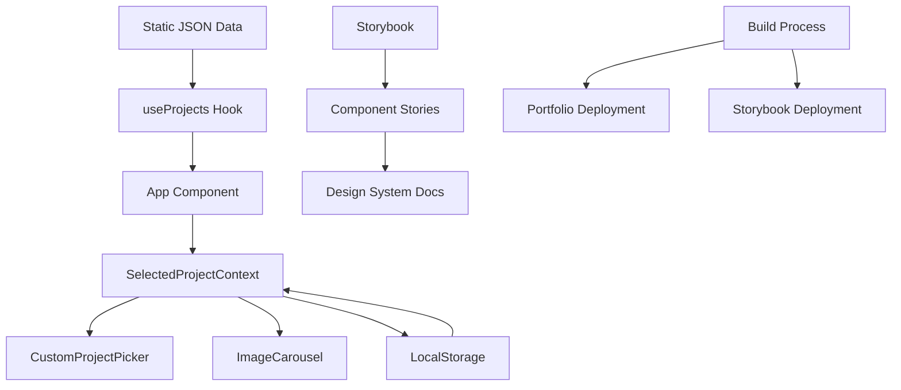

# Repository Overview Analysis Report

**Project:** TKR Portfolio  
**Analyst:** Overview Analysis Agent  
**Date:** 2025-06-25  
**Repository:** `/Volumes/tkr-riffic/@tkr-projects/tkr-portfolio`

## Executive Summary

The TKR Portfolio is a professionally architected React-based portfolio website that demonstrates advanced frontend development practices and modern UI/UX design principles. The project successfully combines a portfolio presentation with comprehensive component documentation through a dual deployment strategy (main site + Storybook).

**Key Strengths:**
- Modern React 19 architecture with hooks-based state management
- Comprehensive design system implementation with Tailwind CSS + shadcn/ui
- Dual deployment strategy enabling both portfolio and documentation
- Well-organized component hierarchy with clear separation of concerns
- Strong development tooling integration (Storybook, Vite, ESLint, Vitest)

**Overall Health Score:** 8.5/10

## Architecture Analysis

### 1. Project Structure

The repository follows a well-organized modular structure with clear boundaries:

```
├── src/
│   ├── components/          # Organized by function, not feature
│   │   ├── ui/             # Base UI primitives (shadcn/ui)
│   │   ├── custom/         # Brand-specific components
│   │   ├── feature/        # Application features
│   │   ├── layout/         # Layout components
│   │   └── html-slides/    # Presentation components
│   ├── hooks/              # Custom React hooks
│   ├── lib/                # Utilities
│   └── data/               # Static data
├── public/                 # Static assets and data files
├── stories/                # Storybook documentation
├── _project/               # Project management & AI tooling
└── Configuration files     # Build, styling, testing configs
```

**Architectural Patterns Identified:**
- **Component-Based Architecture**: React functional components with hooks
- **Presentation-Container Pattern**: Clear separation of data logic and UI
- **Provider Pattern**: Context-based state management for project selection
- **Static Data Architecture**: JSON-based project data with fetch-based loading

### 2. Technology Stack Analysis

**Frontend Framework:**
- React 19.1.0 with modern concurrent features
- Functional components with hooks-based state management
- React Router DOM 7.5.0 for client-side routing

**Build & Development:**
- Vite 6.2.0 as build tool with custom Storybook integration plugin
- ESLint 9.21.0 for code quality
- Vitest + Playwright for testing (configured but minimal implementation)

**Styling & UI:**
- Tailwind CSS 3.4.3 with custom design system
- shadcn/ui component library with Radix UI primitives
- CSS Variables for theme-aware styling
- Custom brand colors and typography system

**Documentation & Deployment:**
- Storybook 9.0.5 for component documentation
- GitHub Pages with custom domain
- Dual deployment strategy (main app + Storybook docs)

### 3. Data Flow Architecture



**Data Flow Characteristics:**
- **Static Data Source**: Projects loaded from JSON file via fetch
- **Context-Based State**: Project selection managed through React Context
- **Persistent Selection**: LocalStorage integration for user preference persistence
- **Unidirectional Data Flow**: Clear data flow from source to UI components

### 4. Component Architecture

The component system follows a hierarchical organization:

**Base Layer (ui/):**
- button.jsx, card.jsx, carousel.jsx - shadcn/ui based primitives
- theme-toggle.jsx - Theme management component

**Custom Layer (custom/):**
- branding.jsx - Brand identity components
- project-card.jsx - Portfolio-specific cards
- color-block.jsx - Design system visualization

**Feature Layer (feature/):**
- custom-project-picker.jsx - Core project selection interface
- image-carousel.jsx - Advanced gallery with Embla Carousel
- content-section.jsx - Layout and content management

**Presentation Layer (html-slides/):**
- Specialized slide components for each portfolio project
- slide-wrapper.jsx - Consistent presentation framework

## Key Architectural Decisions

### 1. Dual Deployment Strategy
**Decision**: Deploy both portfolio site and Storybook documentation to GitHub Pages
**Rationale**: Enables comprehensive component documentation alongside portfolio presentation
**Implementation**: Custom Vite plugin copies Storybook build to portfolio dist folder
**Trade-offs**: Increased build complexity but enhanced documentation capabilities

### 2. Static Data Architecture
**Decision**: Use JSON files for project data instead of CMS or database
**Rationale**: Simplicity, performance, and version control of content
**Implementation**: Fetch-based loading with error handling and loading states
**Trade-offs**: Manual content management but improved performance and simplicity

### 3. Context-Based State Management
**Decision**: Use React Context for project selection state
**Rationale**: Simple state needs don't require external state management
**Implementation**: SelectedProjectContext with localStorage persistence
**Trade-offs**: Sufficient for current scope but may need evolution for complex state

### 4. Component Organization by Function
**Decision**: Organize components by function (ui/, custom/, feature/) rather than by feature
**Rationale**: Supports reusability and design system approach
**Implementation**: Clear hierarchical structure with dependency flow
**Trade-offs**: May become unwieldy as project grows but currently well-organized

## Design System Implementation

### Theme Architecture
- **CSS Variables**: Theme-aware color system
- **Tailwind Integration**: Custom color palette with brand colors
- **Dark/Light Mode**: Implemented via class-based theme switching
- **Typography**: Custom font stack with Adobe Fonts integration

### Brand Colors
```
Primary Colors:
- Tucker Blue: #3B82F6
- Tucker Green: #10B981  
- Tucker Purple: #8B5CF6

Project Colors:
- Taskboard: #F59E0B (Amber)
- Nutrien: #10B981 (Emerald)
- Shaw: #EF4444 (Red)
- Worldplay: #8B5CF6 (Violet)
```

## Scalability Assessment

### Current State
- **Component Count**: ~30 components across 4 organizational layers
- **Project Count**: 5 portfolio projects with comprehensive case studies
- **Bundle Size**: Reasonable for current scope (estimated 200-300KB)
- **Performance**: Static generation with efficient loading

### Scalability Concerns
1. **Component Organization**: May need feature-based organization as it grows
2. **Data Management**: Static JSON may need evolution to CMS for content management
3. **State Management**: May need Redux/Zustand for complex application state
4. **Bundle Size**: Image assets may need optimization/CDN as portfolio grows

### Scaling Recommendations
1. **Implement lazy loading** for slide components and images
2. **Consider headless CMS** for dynamic content management
3. **Add performance monitoring** and bundle analysis
4. **Implement image optimization** pipeline

## Development Workflow

### Build Process
- **Development**: Vite dev server with HMR
- **Testing**: Vitest + Playwright (configured but minimal tests)
- **Linting**: ESLint with Storybook rules
- **Documentation**: Storybook with comprehensive component stories

### Deployment Pipeline
- **Main Site**: Vite build → GitHub Pages
- **Storybook**: Storybook build → integrated into main deployment
- **Custom Domain**: CNAME configuration for branded domain

## Technical Debt Assessment

### Low-Priority Items
- **Test Coverage**: Minimal test implementation (testing framework configured)
- **Error Boundaries**: Limited error handling implementation
- **Accessibility**: Good foundation but could be enhanced
- **Performance Monitoring**: No performance tracking implemented

### Medium-Priority Items
- **Image Optimization**: Large image assets without optimization
- **Bundle Analysis**: No bundle size monitoring
- **SEO Optimization**: Limited meta tag implementation

### Areas of Excellence
- **Code Quality**: Clean, well-organized, and documented code
- **Development Experience**: Excellent tooling integration
- **Design System**: Comprehensive and well-implemented
- **Component Documentation**: Thorough Storybook integration

## Recommendations

### Immediate (0-1 month)
1. **Add comprehensive testing** for critical user flows
2. **Implement image optimization** for performance
3. **Add error boundaries** for better error handling
4. **Enhance SEO meta tags** for better discoverability

### Short-term (1-3 months)
1. **Implement lazy loading** for improved performance
2. **Add performance monitoring** and analytics
3. **Create component testing utilities** for Storybook
4. **Enhance accessibility** with comprehensive auditing

### Long-term (3-6 months)
1. **Consider headless CMS** integration for content management
2. **Implement advanced caching strategies**
3. **Add internationalization** support if needed
4. **Evaluate state management** evolution needs

## Conclusion

The TKR Portfolio represents a well-architected, modern React application that successfully balances portfolio presentation with comprehensive component documentation. The project demonstrates strong architectural decision-making, excellent development practices, and a clear understanding of modern frontend development principles.

The dual deployment strategy and component-based architecture position the project well for future growth and evolution. While there are opportunities for enhancement in testing, performance optimization, and content management, the current foundation is solid and maintainable.

**Key Success Factors:**
- Clear architectural patterns and consistent implementation
- Comprehensive design system with strong brand identity
- Excellent development tooling and documentation
- Modern technology stack with thoughtful library selection
- Well-organized code structure supporting maintainability

The project serves as an excellent example of modern portfolio development and component system design.